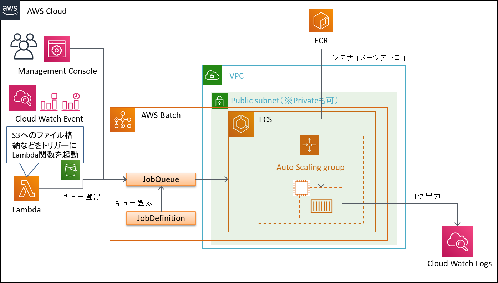

AWS Batch
====
AWS Batchの環境構成図
----

AWS Batchの利用が適しているパタ－ン
----
AWS Batchは以下のうち、 **「大規模計算におけるバッチ処理」** に適している。

* 定型業務におけるバッチ処理
    あらかじめジョブの起動や順序を定義しておいて、ジョブを実行・管理する。
* 大規模計算におけるバッチ処理
    大規模科学計算、機械学習、ゲノム分析等のアドホックな計算。

ジョブの起動方法
----
* Management Console(AWS BatchのGUI)からの起動
* Cloud Watch Eventによる定期実行

AWS Batchを利用できる条件
----
* Dockerコンテナイメージを用意する必要がある。